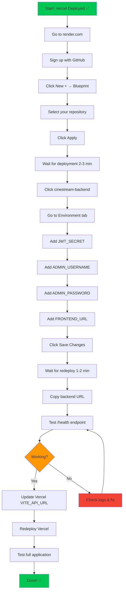
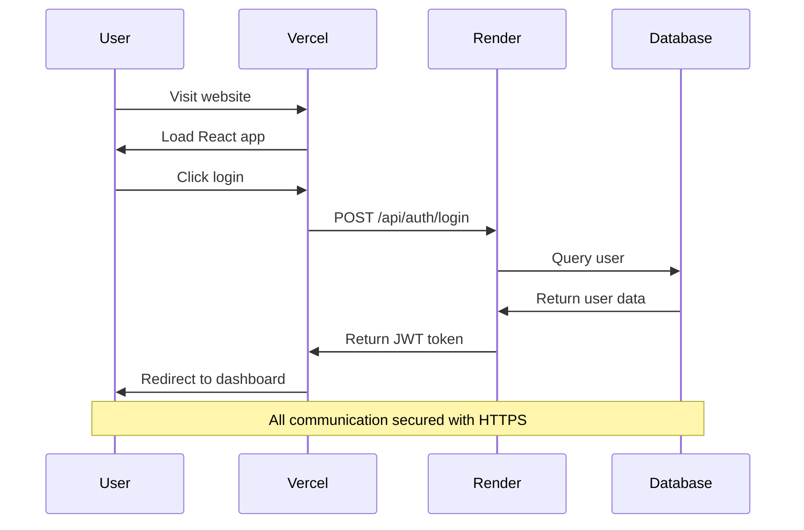

# 🎯 Render Deployment - Quick Visual Guide

## 📊 Deployment Flow



## 🔑 Environment Variables Quick Copy

### For Render Backend

Copy these exactly as shown:

**JWT_SECRET:**
```
eea0e309b45134e93180dea5b9018b21e5024983276405034a7eb91b206bf4b9da611eb44ba6e9ef98a040cf7b46fef1f2731171b0b8c23b86721d01bc8666b9d
```

**ADMIN_USERNAME:**
```
admin
```

**ADMIN_PASSWORD:**
```
[Your strong password - create one!]
```

**FRONTEND_URL:**
```
https://[your-vercel-url].vercel.app
```
⚠️ Replace `[your-vercel-url]` with your actual Vercel URL!

---

## 📸 Visual Step-by-Step

### Step 1: Create Blueprint
![Blueprint Creation Process]
1. Click "New +" button (top right)
2. Select "Blueprint"
3. Choose your GitHub repository
4. Click "Apply"

### Step 2: Add Environment Variables
![Environment Variables Screen]
1. Click service name "cinestream-backend"
2. Click "Environment" in sidebar
3. Click "Add Environment Variable"
4. Enter key and value
5. Repeat for all 4 variables
6. Click "Save Changes"

### Step 3: Verify Deployment
![Health Check]
1. Copy your backend URL
2. Add `/health` to the end
3. Open in browser
4. Should see JSON response with "success: true"

---

## ⚡ Quick Troubleshooting

| Problem | Solution |
|---------|----------|
| 🔴 CORS Error | Check FRONTEND_URL matches Vercel URL exactly |
| 🔴 Admin login fails | Verify ADMIN_USERNAME and ADMIN_PASSWORD are set |
| 🔴 Database error | Check database status is "Available" |
| 🟡 Slow first request | Normal for free tier (30s wake-up time) |
| 🔴 Service unavailable | Check logs for errors, try manual redeploy |

---

## ✅ Final Checklist

After completing all steps, verify:

- [ ] Backend URL responds to `/health` endpoint
- [ ] Render logs show "PostgreSQL database ready"
- [ ] Render logs show "Default admin user created"
- [ ] Database status is "Available"
- [ ] Vercel has correct VITE_API_URL
- [ ] Frontend can register new users
- [ ] Frontend can login users
- [ ] Admin can access admin dashboard
- [ ] No CORS errors in browser console

---

## 🎯 What Happens After Deployment?



---

## 📞 Support Resources

- **Detailed Guide:** [render-deployment-detailed.md](file:///L:/porn/cinestream-pro-afterdark/docs/render-deployment-detailed.md)
- **Render Docs:** https://render.com/docs
- **Render Status:** https://status.render.com
- **Community:** https://community.render.com

---

**Ready to deploy?** Follow the detailed guide step-by-step! 🚀
